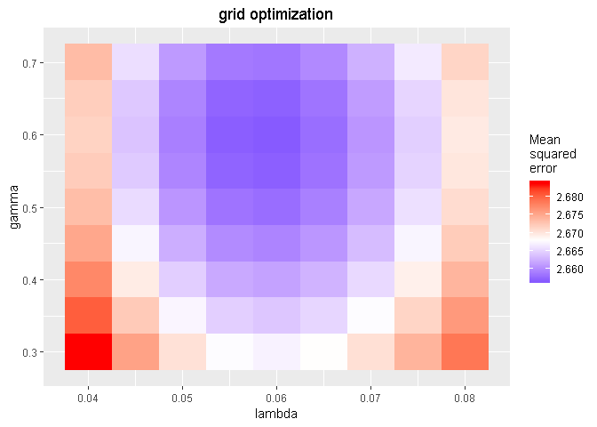

Pi Ratings
================
Lars Van Cutsem
2019-05-17

<!-- README.md is generated from README.Rmd. Please edit that file -->
<!-- badges: start -->
<!-- badges: end -->
The goal of piratings is to calculate dynamic performance ratings for association football teams in a competitive match setting. The pi rating system takes into account the team's performance in recent matches, the well-known home advantage effect and, the fact that a win is more important than increasing the score difference. The dynamic rating system has proven to obtain superior results in predicting the outcome of association football matches.

The pi rating system was developed by Constantinou and Fenton in the research paper "Determining the level of ability of football teams by dynamic ratings based on the relative discrepancies in scores between adversaries".

The paper can be found [here](http://www.constantinou.info/downloads/papers/pi-ratings.pdf)

Installation
------------

You can install the released version of piratings from [CRAN](https://CRAN.R-project.org) with:

``` r
install.packages("piratings")
```

Example
-------

This is a basic example which shows you how to use the package:

``` r
library(piratings)

## example data from the European Soccer Dataset
## for the English Premier League during the seasons
## 2008/2009 to 2015/2016

data("EPL2008_2015")
head(EPL2008_2015)
#>                  date        home_team            away_team home_goals
#> 1 2008-08-16 00:00:00          Arsenal West Bromwich Albion          1
#> 2 2008-08-16 00:00:00       Sunderland            Liverpool          0
#> 3 2008-08-16 00:00:00  West Ham United       Wigan Athletic          2
#> 4 2008-08-16 00:00:00          Everton     Blackburn Rovers          2
#> 5 2008-08-16 00:00:00    Middlesbrough    Tottenham Hotspur          2
#> 6 2008-08-16 00:00:00 Bolton Wanderers           Stoke City          3
#>   away_goals
#> 1          0
#> 2          1
#> 3          1
#> 4          3
#> 5          1
#> 6          1
```

We prepare the function arguments:

``` r
## prepare the function arguments:
teams <- as.matrix(EPL2008_2015[, c("home_team", "away_team")])
outcomes <- as.matrix(EPL2008_2015[, c("home_goals", "away_goals")])

grid <- optimize_pi_ratings(teams, outcomes, seq(0.04, 0.08, 0.005), seq(0.3, 0.7, 0.05))
```

Finally, we can plot the result of the grid optimization using ggplot2:

``` r
## we plot this grid using the ggplot2 library
library(ggplot2)

ggplot(data = grid, aes(x = lambda, y = gamma, fill = mean.squared.error)) + 
  geom_tile() + scale_fill_gradient2(low = "blue", mid = "white", high = "red", midpoint = 2.668) + 
  labs(x = "lambda", y = "gamma", title = "grid optimization", fill = "Mean \nsquared \nerror") + 
  theme(plot.title = element_text(hjust = 0.5))
```



``` r

## we find the optimal parameter settings to be
## lambda = 0.06 and gamma = 0.6

piratings <- calculate_pi_ratings(teams, outcomes, 0.06, 0.6)
tail(piratings)
#>               [,1]        [,2]
#> [3035,] 0.94280097  0.21240516
#> [3036,] 0.27533743  0.41752676
#> [3037,] 0.35240392  0.68135781
#> [3038,] 0.01547854 -0.03855970
#> [3039,] 0.06408034  0.53412326
#> [3040,] 0.88992232 -0.07992604
```

Data
----

Contains information from the European Soccer Database, which is made available [here](https://www.kaggle.com/hugomathien/soccer) under the [Open Database License](https://opendatacommons.org/licenses/odbl/1.0/) (ODbL) .
